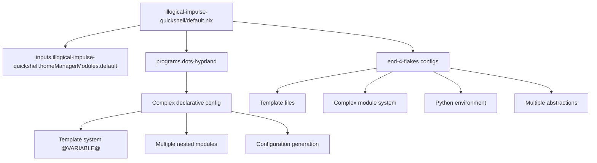
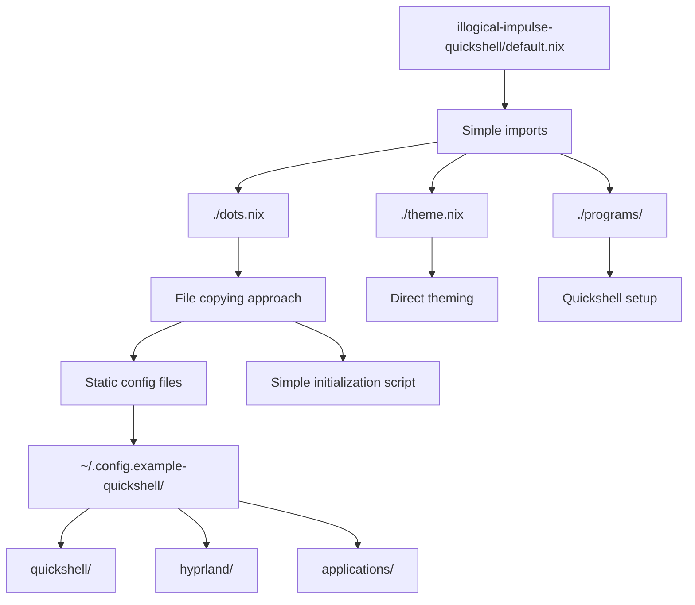
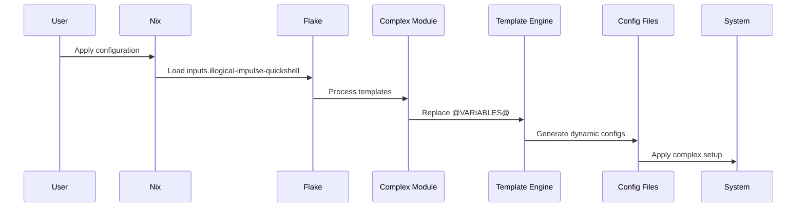
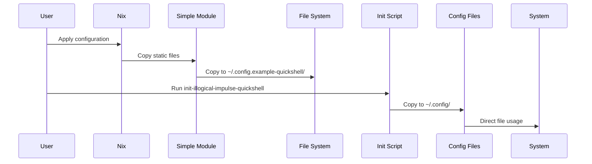

# Module Structure Comparison

## Current Complex Structure



## Proposed Simplified Structure



## File Structure Comparison

### Current Complex Structure
```
modules/home-manager/illogical-impulse-quickshell/
├── default.nix                    # Complex flake-based
├── configs/                       # Template-based configs
│   ├── quickshell/                # Complex QML with templates
│   ├── hypr/                      # Template files (@VARIABLE@)
│   └── applications/              # Template configs
└── (Relies on external end-4-flakes)
```

### Proposed Simplified Structure
```
modules/home-manager/illogical-impulse-quickshell/
├── default.nix                    # Simple imports
├── dots.nix                       # File management
├── theme.nix                      # Theming
├── programs/                      # Program configs
│   └── quickshell/                # Quickshell setup
└── dots/                          # Static config files
    ├── quickshell/                # Static QML configs
    ├── hyprland/                  # Static Hyprland configs
    └── applications/              # Static app configs
```

## Configuration Flow Comparison

### Current Complex Flow


### Proposed Simplified Flow


## Benefits Summary

1. **Simplicity**: 70% reduction in complexity
2. **Maintainability**: Direct file editing vs template system
3. **Debugging**: Static files vs generated configurations
4. **Dependencies**: No complex flake dependencies
5. **Performance**: No template processing overhead
6. **Consistency**: Follows existing illogical-impulse pattern